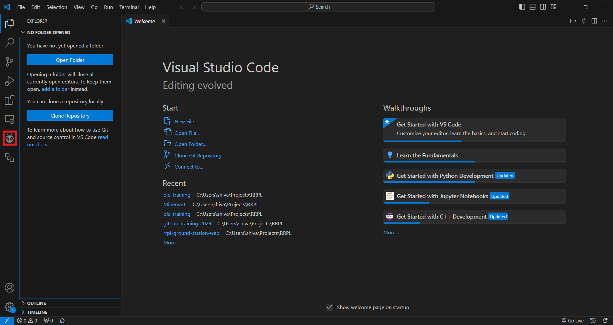
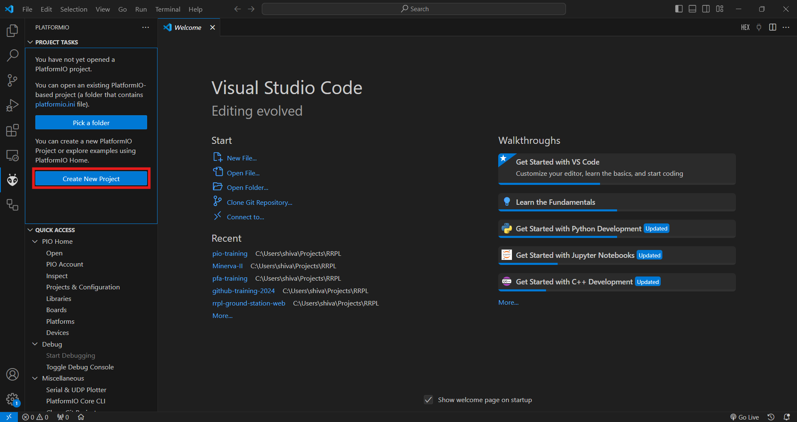
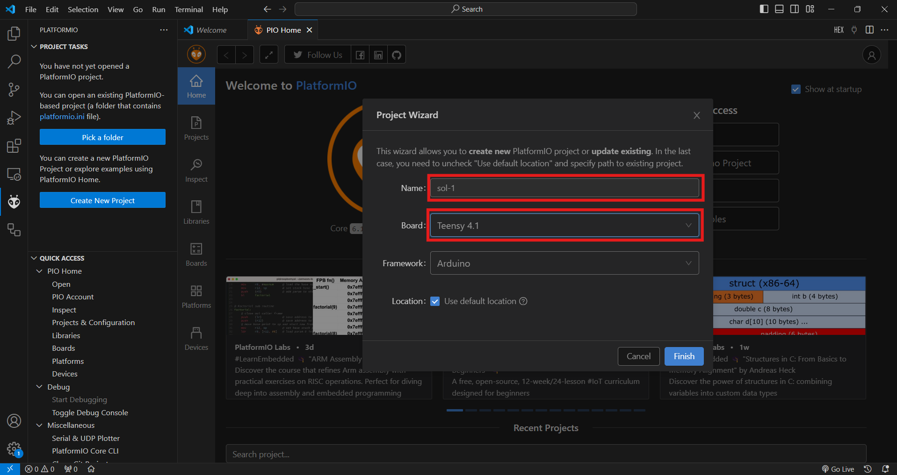
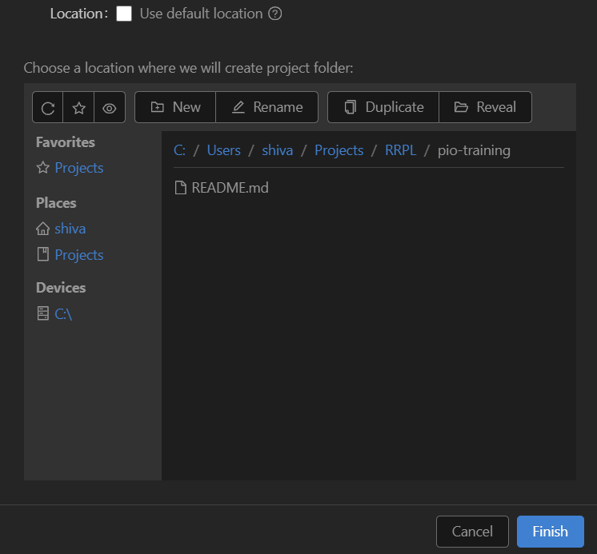
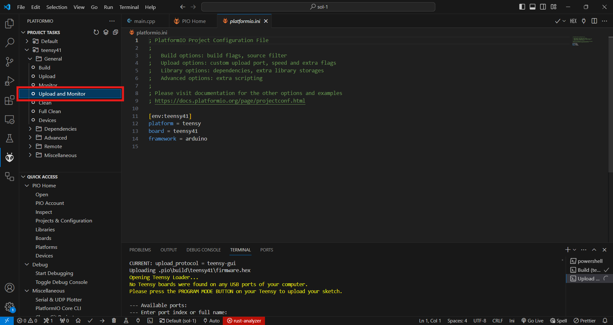

# Platform IO Training

The goal of this training is to familiarize new members with the tools and general workflow involved in developing firmware for embedded systems. This training will cover the basic motions of programming in C++, setting up your Platform IO Installation, creating projects, running the build chain, and deploying to a microcontroller.

## 0: Foundations

When you write software, you generally spend most of your time writing code, i.e. specifying a sequence of instructions for the computer to execute. For simple projects, like "Hello World!" (which we will do below) or introductory textbook exercises, we don't have to work too hard to answer questions about where (the computer) and how (play button, run command, etc.) our projects are run. However, when building systems in lower-level environment, such as a flight computer or test electronics, these questions are more challenging. How do you move code on your PC to the memory of an MCU? How do you ensure it will run? What about dependencies (outside code your code references)? How do I communicate with the outside world?

Where these questions are trivial to answer when tackling problems like arithmetic and breadth-first search, we need to spend dedicated time defining these answers to build the types of things we need to test and fly a rocket. We'll spend the rest of this training doing just that, but here are some easy ones to get you started:

1. What is an embedded system?
   An embedded system is a microprocessor-based system with hardware and software designed to perform a dedicated function or control a specific operation within a larger system. In our case, the flight computer is an embedded system.
2. How is an embedded system different from a regular computer?
   An embedded system is task-specific with limited resources and real-time constraints, whereas a regular computer is general-purpose and designed to handle a variety of applications and tasks.
3. What kinds of devices use embedded systems?
   Apart from rockets, devices such as automotive control units, industrial robots, medical equipment, smartphones, and network routers use embedded systems.
4. What role does software play in embedded systems?
   Software in embedded systems manages hardware interaction, real-time task scheduling, and system performance optimization, often through firmware or specialized operating systems. In our case, we will write software to collect data from sensors, compute flight information based on that data, and send that data to memory and a ground station through a radio.
5. What is a microcontroller, and how does it work?
   A microcontroller is a self-contained chip with a CPU, memory (RAM, ROM), and peripherals, used to execute a program that controls specific tasks within an embedded system, often via direct control of hardware components. For entry-level and intermediate projects, we use an NXP iMXRT1062 (ARM Cortex-M7 core) MCU. As a team, we're currently working on transitioning to STM32 MCUs for more complex and capable projects.

### 0.1: Background

Recall how, in order to program in Python, you needed to install Python onto your computer. Likewise, when running software written in Java, you need to download something called the Java Runtime Environment (JRE). Now, note how most of the software you download off the web *doesn't* require you to download whatever tools were used to program it. Some applications, like Minecraft, cleverly hide tools like the JRE inside of them, simplifying the installation process for the user. Other applications, however, like Adobe Photoshop, Mozilla Firefox, and VLC media player, do not rely on such tricks. Instead, these programs are shipped as standalone executables. This is achieved by shipping *compiled* code, rather than shipping source or bytecode. That is to say, these programs are written in some programming language (in this case C++) and then processed by the compiler to create something that can be directly executed by the computer. While this explanation glosses over multiple CS courses worth of of complexity, it does explain why we need to download a compiler, but not a runtime environment like python.exe or the JRE. Even though we'll download a bunch of tools to help us program in C++, the output of these tools (the executable) will function even if all of these tools are deleted. That is **not** true when working in Java or Python. Deleting the JRE or Python.exe will leave Java and Python projects unrunnable.

Applying this to the task at hand, we will write code in C++, compile that code into binary, and load it onto the memory of the micro-controller. This is not dissimilar to writing code for your PC, although the lack of an operating system changes how we go about interacting with the hardware and external libraries. So, while the general steps may be familiar, take note of how things are different when building for MCUs and PCs.

For our firmware development build chain, we use an open source tool called PlatformIO. In short, PlatformIO is useful because it bundles together a bunch of individual tools for writing and deploying code for embedded systems and presents them to us wrapped up with a nice interface. Put simply, *there is [no magic](https://bou.ke/blog/no-magic/) under the hood.* Every task performed when you hit "Build and Upload" is one that you (yes, I mean you *right now*) could do step-by-step yourself. All PlatformIO does is put those steps together and give you a button to click to execute them. (This idea, broadly, is called *abstraction.*)

### 0.2: Installation

If you don't have VSCode Installed, [please follow the official instructions.](https://code.visualstudio.com/docs/setup/setup-overview) Likewise, if you don't have PlatformIO for VSCode installed, [you can find the instructions on the PLatformIO website.](https://platformio.org/install/ide?install=vscode)

## 1: Going Forwards, Backwards

In order to fully understand what goes into programming an MCU (like the flight controller), it is good idea to understand what code actually is and how the build chain lets us transform ideas into distinct, useful electrical signals on hardware.

### 1.1: What is code?

Going back to basics, in CS 101 you learned something along the lines of:

 "'**code**' is typically defined as a set of instructions written in a *programming language* that a computer can understand and execute to perform specific tasks or solve problems."

 While this is true, let's revisit this definition with a more critical eye. For one, you'll notice that the CS 101 definition of code is extraordinarily **broad**, covering everything from the almost-pseudo-code, superficial Scratch to almost incomprehensible machine code, even [novelty languages](https://en.wikipedia.org/wiki/Esoteric_programming_language) are, by definition, "code". Broadly, we can create some notion of a "*hierarchy*" of programming languages. On one end, we can put the highest, high-level languages, where a code snippets and white-board pseudo-code are almost indistinguishable. Any sufficiently rigorously [formalized](https://en.wikipedia.org/wiki/Formal_language) set of instructions can be considered a [programming language](https://en.wikipedia.org/wiki/Programming_language). In the case of pseudo-code, you act as the translator, mapping your brainstormed instructions into a traditional programming language (like C++). One could meaningfully describe this as "compiling" your pseudo-code into source code. Given enough technical work and formalization, you could even create a program, say a "compiler," that translates your formalized pseudo-code into C++ for you. Let's continue that idea into the computer. Because programming languages (C++, Assembly, Machine Code, etc.) are all formal (all words have specific definitions and specific relationships with other words), we can go between all of them with predefined compiler programs. (Though we could also do it by hand! Remember, there is no magic under the hood!)

For clarity's sake, let's define "source code", though it should sound quite familiar. Source code refers to the human-readable instructions written in a programming language like C++. In an embedded setting, these instructions define the behavior of a microcontroller, a small processor that interacts with hardware like sensors, lights, even other devices.

### 1.2: Where does code go?

The build chain is the sequence of steps that converts this high-level source code into a form the microcontroller can understand and execute. This process involves several stages:

1. Preprocessing: Handles macros and includes external libraries (e.g., #include <Arduino.h>).
2. Compilation: Converts C++ into assembly code, which is more closely tied to the machine's architecture.
3. Assembly: Translates assembly into machine code (binary form), which can be understood by the microcontroller.
4. Linking: Combines various pieces of machine code (from libraries, for example) into one executable file.
5. Flashing: Writes the executable to the microcontroller’s memory.

Contrast this with how the process works on a PC, where a program runs in user space, isolated from hardware. In an embedded system, the program runs in bare metal, directly interacting with hardware, often with no operating system in between. On a similar note, when we write code for PCs, we can call on shared system libraries to do certain tasks. For example, if we want to allocate memory, we can simply call `malloc` from the C Standard library. On a PC, your compiled code will simply refer to whatever distribution of the C standard library comes with your OS (the GNU C Library, or *glibc*, for example). That is to say, the executable produced by compiling your source code doesn't actually contain the instructions for `malloc`. Instead, it points to some other binary on the machine to execute some requested task (sort of like "handing off the work" to someone else, expecting a specific output). On the other hand, when we write code for MCUs, there is no OS, and therefore no system libraries, thus all of the libraries we use get packaged into the binary for our program. This is referred to as [static linking, as opposed to dynamic linking](https://csbio.unc.edu/mcmillan/Comp411F17/Lecture12.pdf). (Further reading [here](https://www.cs.fsu.edu/~baker/opsys/notes/linking.html), for the real CS sickos.) As you'll see below, this means that whatever we use from libraries like `Arduino.h` gets directly put into our assembly and machine code.

Let's follow the journey of an example program below.

```cpp
   #include <Arduino.h>  // Include the Arduino library

   void setup() {
      // LED_BUILTIN is a predefined *macro* that translates to the pin number of the built-in led
      pinMode(LED_BUILTIN, OUTPUT);  // Set the built-in LED pin as an output
   }

   void loop() {
      digitalWrite(LED_BUILTIN, HIGH);  // Turn the LED on
      delay(1000);                       // Wait for 1 second
      digitalWrite(LED_BUILTIN, LOW);   // Turn the LED off
      delay(1000);                       // Wait for 1 second
   }
```

#### 1. Preprocessing

During preprocessing, directives such as #include are resolved, and macros are expanded. The output is a modified source code file that is easier for the compiler to process.

#### 2. Compilation

The compilation stage translates the preprocessed C++ code into assembly language code. This is where the compiler generates low-level instructions specific to the target architecture. When working with Arduinos, and most Arduino-like hardware, source code is compiled to [AVR assembly](https://en.wikipedia.org/wiki/Atmel_AVR_instruction_set). Different assembly languages are basically different sets of mnemonics that map to specific operation instructions for the CPU.

```Assembly
   ; Sample AVR Assembly Code

   ; Function: setup
   setup:
      ldi r24, (1 << DDB5)   ; Load immediate value into register r24 (Configure pin as output)
      out DDRB, r24          ; Set DDRB register to configure pin

      ; Return from function
      ret                     ; Return to caller

   ; Function: loop
   loop:
      sbi PORTB, PB5         ; Set bit in PORTB to turn on LED
      call delay             ; Call delay function
      cbi PORTB, PB5         ; Clear bit in PORTB to turn off LED
      call delay             ; Call delay function
      rjmp loop              ; Jump back to the start of the loop
```

1. ```ldi r24, (1 << DDB5)```: Load an immediate value into register r24, configuring a specific pin (e.g., PB5 for the built-in LED) as an output.

2. ```out DDRB, r24```: Write the value of r24 to the DDRB register, which controls the data direction for port B.

3. ```sbi PORTB, PB5```: Set the corresponding bit in the PORTB register to turn on the LED.

4. ```call delay```: Call a subroutine to introduce a delay.

5. ```cbi PORTB, PB5```: Clear the corresponding bit in the PORTB register to turn off the LED.

6. ```rjmp loop``` Jump back to the beginning of the loop function, creating an infinite loop.

#### 3. Linking

Linking combines multiple object files generated by the compiler and resolves references between them. In embedded systems, this may involve linking libraries (like the Arduino core library) with your code.

#### 4. Uploading

After linking, the final executable is uploaded to the microcontroller's memory. This process often involves using a programmer or an onboard bootloader. You'll see this in action once you start writing and running programs for yourself.

### 1.3: Running Code

In embedded systems, once a program is written to flash memory, there’s a specific sequence of steps that occurs for the code to start executing on a microcontroller (MCU). This process is critical for understanding how microcontrollers operate.

#### 1. Flash Memory and Program Storage

Flash memory is non-volatile storage, which means that it retains information even when power is removed. Code is written to this memory in binary format, typically as a series of bits representing machine instructions for the microcontroller.

Example: A simple LED blink program might be converted into binary, such as:

```Binary
00111000 00000001 00000000 00000000 01011000 00000001
```

(As is totally obvious and not at all random looking, I'm sure...)

#### 2. Power-On Reset (POR)

When power is applied to the microcontroller, the first thing that happens is a Power-On Reset (POR). This reset is crucial because it initializes the microcontroller to a known state.

- Reset Circuitry: An internal reset circuit is triggered when power is applied. This ensures that all registers are set to their default values (usually zero).
- Reset Vector: During the reset process, the MCU's program counter (PC) is set to a predefined address in the flash memory known as the reset vector. This address typically points to the start of the setup() function or the main entry point of the program.

#### 3. Fetching the Reset Vector

After the reset:

1. Program Counter (PC) Initialization:

- The program counter is initialized to the reset vector address. For many MCUs, this address is hardcoded in the architecture's design.
- For example, if the reset vector is located at address 0x0000, the PC is set to 0x0000.

2. First Instruction Fetch:

- The MCU fetches the first instruction from the address pointed to by the program counter (0x0000 in this case).
- The MCU reads the bits stored in flash memory at that address, which represents the first instruction of the program.

#### 4. Instruction Decode

After fetching the instruction:

- The fetched binary instruction is sent to the Instruction Decoder.
- The instruction decoder interprets the binary representation and translates it into control signals for the CPU to execute.

#### 5. Execution Cycle

The execution of instructions typically follows the fetch-decode-execute cycle:

1. Fetch: The MCU retrieves the next instruction from flash memory based on the program counter (PC), which is incremented after each fetch.
2. Decode: The instruction is decoded, determining what operation to perform, and the relevant operands (data) are fetched from the registers or memory if necessary.
3. Execute: The instruction is executed by the ALU (Arithmetic Logic Unit) or other functional units of the MCU. This could involve manipulating registers, performing calculations, or reading from or writing to I/O ports.

#### 6. Handling Branches and Loops

If an instruction involves branching (like a conditional statement or a loop), the program counter is updated to point to a different address in the flash memory, allowing the execution to jump to different sections of code.
For example, if an instruction calls for a conditional jump, the program counter may be set to an address calculated based on the current state (such as the result of a previous comparison).

#### 7. Interrupts and Other Events

Microcontrollers often have various types of interrupts that can affect the execution flow:

1. Interrupt Service Routines (ISRs): If an interrupt occurs (e.g., from a timer or an external signal), the MCU can temporarily halt the current execution to execute an ISR.
2. Upon entering the ISR, the program counter is pushed onto the stack, and the PC is set to the interrupt vector address.
3. After executing the ISR, the program counter is restored from the stack, and execution resumes from where it left off.

#### 8. Infinite Loop

In embedded systems, particularly with Arduino, the loop() function runs indefinitely after the setup() function completes:

- The program counter continuously cycles through the instructions in the loop() function, executing them over and over.
- This looping mechanism is essential for tasks that need constant monitoring or control, such as reading sensors or responding to user input.

#### 9. Ending Execution

In embedded environments, unlike conventional operating systems, there isn’t a typical “exit” condition for the program. The MCU simply continues executing until:

- Power Off: The power is removed, resetting the MCU.
- Watchdog Timer: If implemented, it can reset the MCU if it fails to complete its tasks within a specified timeframe.

This can be especially challenging in cases where you want specific tasks to be done at the "end" of whatever process you're trying to do.

## 2: Actually Doing Stuff

Enough reading, time to code. (Also more reading, though...)

### 2.1: Creating a PIO Project

After installing PlatformIO, restart VSCode and click on the alien head in the sidebar to open PIO.



After opening PIO, click on "Create New Project" to create your first PIO project.



Creating a new project will pull up the Project Wizard. Be sure to name your project something unique (i.e. **not** "sol-1") and select "Teensy 4.1" as the board. You'll notice that we'll be using the Arduino Framework.



Be sure to uncheck the "Use Default Location" flag to place the new project alongside the rest of your RRPL work. You can see below that I use the `C:Users\shiva\Projects\RRPL` folder when working on things for the team. Make sure that you are not in a OneDrive folder when creating your project!



Now, clicking "Finish" will create your first embedded project in the folder you specified. After some time, you should see a blank editor window in VSCode. Navigate to `main.cpp` in the `src` directory.


### 2.2: Programming Basic Projects

Our first project will be a basic adder program, largely similar to the example project generated by PIO itself.

**Task:** Write a basic Arduino program that uses serial communication to continuously calculate the sum of two numbers, updating the numbers on each iteration of the loop. The function to compute the sum should take two 8-bit unsigned integers as input and return their sum.

A simple solution is provided below (for your Ctrl+C, Ctrl+V convenience).

```cpp
#include <Arduino.h>

// put function declarations here:
uint8_t myFunction(uint8_t, uint8_t);

uint8_t a, b;
uint8_t result;

void setup() {
  Serial.begin(9600);
  // put your setup code here, to run once:
  result = myFunction(2, 3);
  Serial.printf("Test Result: %d", result);
  
  a = 0;
  b = 0;

}

void loop() {
  delay(500);
  result = myFunction(a, b);
  Serial.printf("%d + %d = %d", result);
  a += 1;
  b += 2;
}

// put function definitions here:
uint8_t myFunction(uint8_t x, uint8_t y) {
  return x + y;
}
```

### 2.3: Building and Running

Now that you've written your first embedded program. It's time to build and upload. Navigate to the "PROJECT TASKS" menu PIO and select "Build and Upload." This will run the build chain on your code, flash the binary onto the MCU, and power cycle the MCU to run the program. You can watch your program run by selecting "Monitor" afterwards.



## 3: Exercises

### 3.1: Addition

The code written above for a simple adder breaks after a while. Why? Try to find a solution that can add two 8-bit numbers without error over their entire range.

### 3.2: Handling Data

***TBD***

### 3.3: Interfacing with the Outside World

***TBD***
